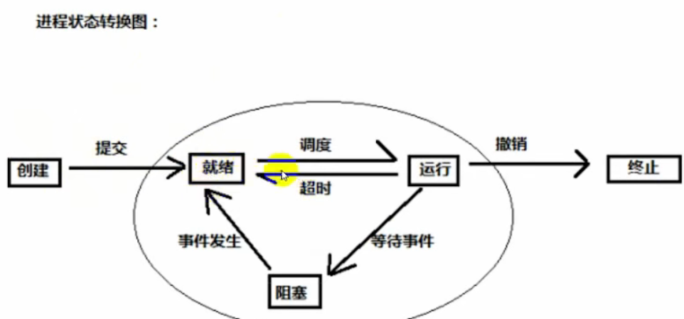

# 进程管理

## 引入进程的目的

为了更好地描述和控制程序并发执行，实现操作系统的并发性和共享性（**进程是动态的，程序是静态的**)

## 进程的定义

是计算机中的程序关于某数据集合上的一次运行活动，**是系统进行资源分配和调度的基本单位（没有引入线程的情况下）**

## 进程的组成

1. PCB:进程控制块,保存进程运行的相关数据,是进程存在的唯一标识
2. 程序段:能被进程调度到cpu的代码
3. 数据段

## 进程的状态

1. 创建态
   1. 进程正在被创建
2. 就绪态
   1. 进程已处于准备运行的状态，即进程获得了除处理机外的一切所需资源，一旦得到处理机即可运行。
3. 运行态
   1. 进程正在占用cpu
4. 阻塞态
5. 结束态
   1. 进程正在从系统消失

## 线程

### 引入的目的

为了更好的使用多道程序并发执行，提高资源利用率和系统吞吐量

### 特点

是程序执行的最小单位，基本不拥有任何系统资源（**调度的基本单位**)

> 注意:资源分配的基本单位还是进程

# 处理机调度

## 概念

是对处理机进行分配，即从**就绪队列**中按照定的算法(公平、高效)选择一个进程并将处理机分配给它运行，以实现进程并发地执行。

## 分类

1. 高级调度：作业调度，次数少
2. 中级调度：内存对换，次数中
3. 低级调度：进程调度，次数多

## 调度方法

1. 剥夺式
   1. 如果一个进程在运行时，来了个优先级更高的进程，那这个进程就得下处理机了
2. 非剥夺式
   1. 与上面相反，做完再换

## 调度准则

1. cpu利用率
2. 系统吞吐量
   1. 单位时间内**作业**完成的数量
3. 周转时间
   1. 作业的完成时间-作业的提交时间
4. 等待时间
   1. 进程等待调度的时间片总和,周转时间-运行时间
5. 响应时间
   1. 从进程提交到首次运行的时间段

## 算法（作业调度）

1. 先来先服务FCFS
   1. 按作业到达的先后次序进行调度。总是首先调度在系统中等待时间最长的作业。
2. 短作业优先
   1. 哪个作业短哪个优先
3. 优先级调度
4. 高响应比优先调度
   1. 响应比＝（等待时间＋要求服务时间）／要求服务时间,所以一定大于1
   2. 弹幕里有这样说的（等待时间＋运行时间）／运行时间
5. 时间片轮转
   1. 一定是剥夺式的，而其他的都行
6. 多级队列反馈调度

# 进程同步

## 引入原因

协调进程之间的相互制约关系

## 制约关系

1. 同步(直接制约关系)
   1. 是指为完成某种任务而建立的两个或多个进程，这些进程因为需要在某些位置上协调它们的工作次序而等待、传递信息所产生的制约关系。
2. 互斥(间接制约关系)
   1. 当一个进程进入临界区使用临界资源时，另一个进程必须等待，当占用临界资源的进程退出临界区后，另进程才允许去访问此临界资源。例如进程1使用了打印机(打印机为临界资源),进程2想用只能等1用完

## 临界资源

一次仅允许一个进程使用的资源

例如

1. 打印机
2. 共享缓冲区
3. 共享变量
4. 公用队列

## 临界区

每个进程访问临界资源的那段**程序**

## 临界区互斥

### 原则

1. **空闲让进**:如果有若干进程要求进入空闲的临界区，一次仅允许一个进程进入。
2. **忙则等待**:任何时候，处于临界区内的进程不可多于一个。如已有进程进入自己的临界区，则其它所有试图进入临界区的进程必须等待。
3. **有限等待**:进入临界区的进程要在有限时间内退出，以便其它进程能及时进入自己的临界区。
4. **让权等得**:如果进程不能进入自己的临界区则应让出CPU，避免进程出现“忙等”现象。

### 基本方法

#### 信号量

利用pv操作实现互斥

# 死锁

## 产生的原因

非剥夺资源的竞争和进程的不恰当推进顺序(与饥饿的区别)

> 饥饿:进程需要资源,但是一直没有得到满足

## 定义

多个进程因竞争资源而造成的一种僵局，如果没有外力，这些进程将无法推进

## 解决办法

1. 预防死锁

   1. 破坏互斥条件
   2. 破坏不剥夺条件
   3. 破坏请求和保持条件
   4. 破坏循环等待条件
   5. 以上四条为死锁产生的**必要条件**,所以可以通过这样预防
2. 避免死锁

   1. 安全状态
   2. **银行家算法**
3. 检测死锁

   1. 利用死锁定理
4. 解除死锁

   1. 资源剥夺
   2. 撤销进程
   3. 进城回退

# 例题

[操作系统 三小时速成课 课时2 题目_哔哩哔哩_bilibili](https://www.bilibili.com/video/BV1Kd4y1Z7dd?p=3&vd_source=dc97a7c38012722963aff34e3f351c40)
