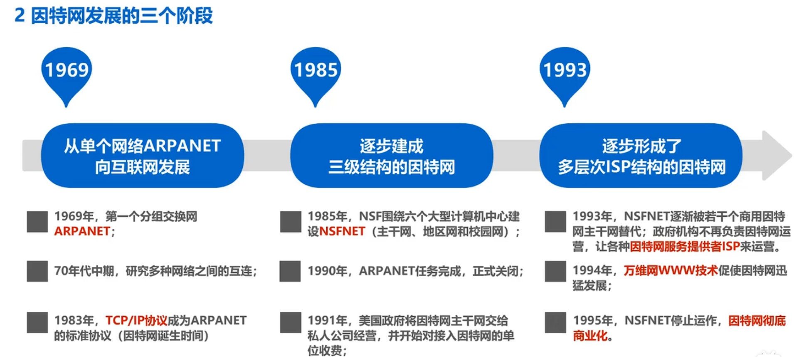
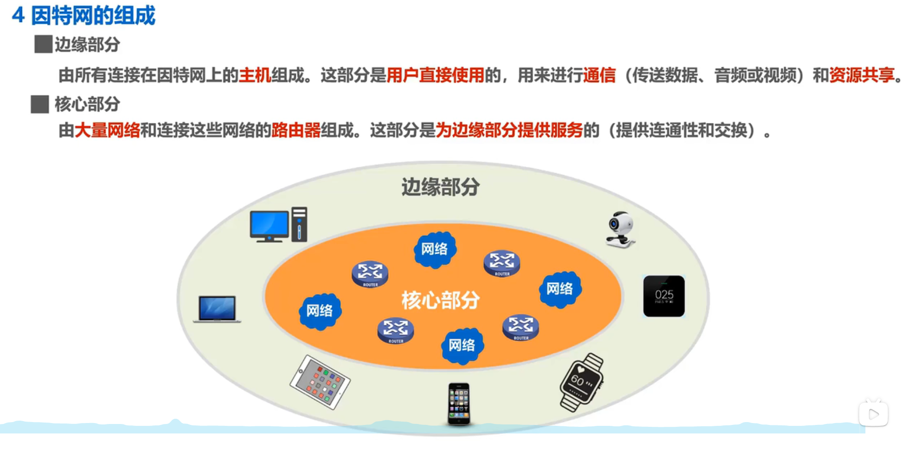
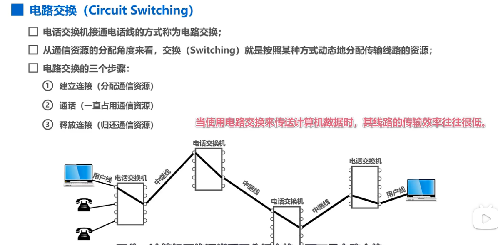
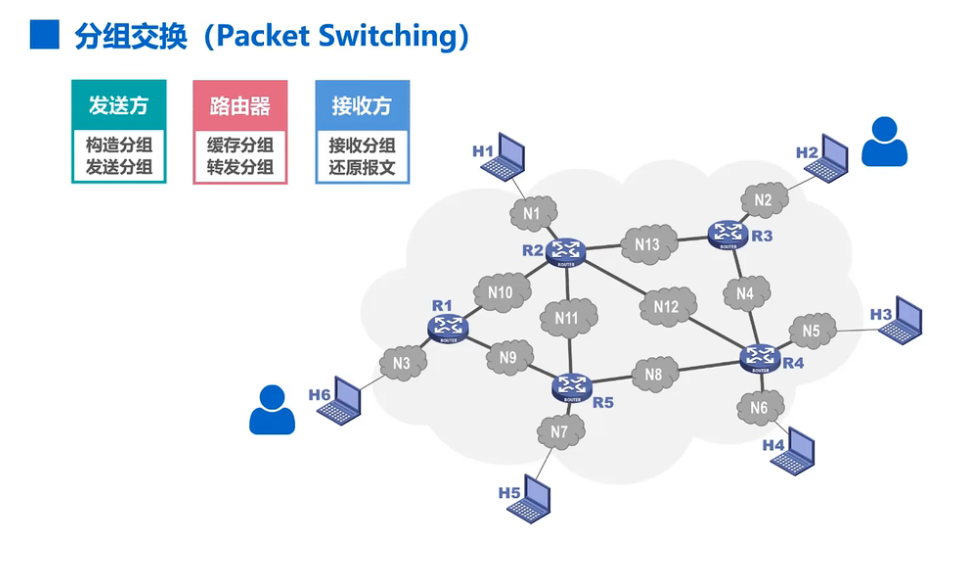
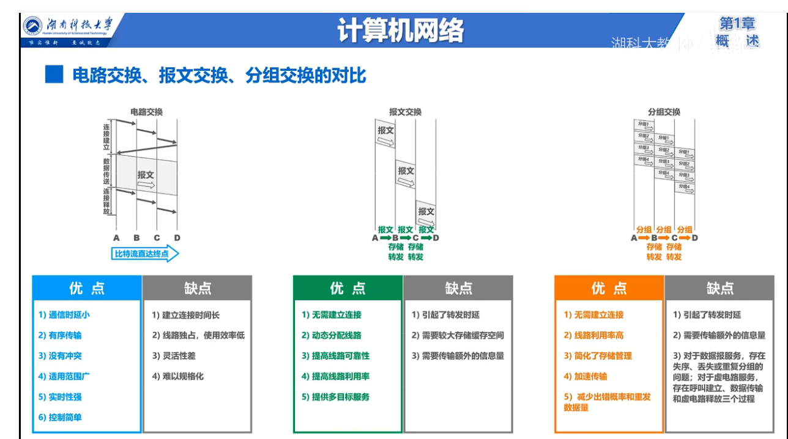
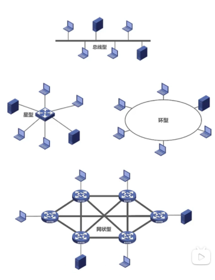
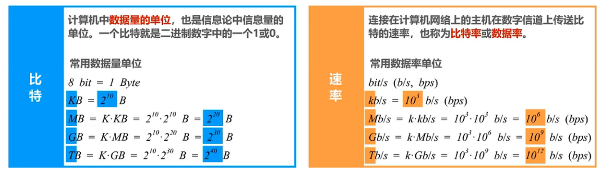
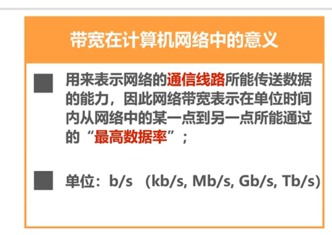
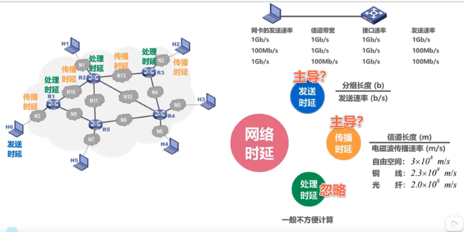

# Internet（因特网）发展的三个阶段

# 因特网的组成

# 三种交换方式

## 电路交换

## 分组交换

## 报文交换

与分组交换类似，只不过不限制报文的大小，现在基本不用。

## 三者对比

# 计算机网络的定义

- 精确定义尚未统一
- 最简单的定义：一些**相互连接**，**自治**的计算机**集合**

  - 互连 是指计算机之间可以通过有线或无线的方式进行数据通信;
  - 自治 是指独立的计算机，它有自己的硬件和软件，可以单独运行使用;
  - 集合 是指至少需要两台计算机;
- 较好的定义：计算机网络主要由一些**通用的、可编程的硬件**互联而成，而这些硬件并非用来实现某一特定目的（例如传输数据或者视频信号）。这些**可编程的硬件**能够用来**传送多种不同类型的数据**，并能**支持广泛和日益增长的应用**

  - 计算机网络所连接的硬件，并不限于一般的计算机，而是包括了智能手机等智能硬件。
  - 计算机网络并非专门用来传送数据，而是能够支持很多种的应用（包括今后可能出现的各种应用)。
  - 

# 计算机网络的分类

- 按交换技术分类

  - 电路交换网络
  - 分组交换网络
  - 报文交换网络
- 按使用者分类

  - 公用网
  - 专用网
- 按传输介质分类

  - 有线网络
  - 无线网络
- 按覆盖范围分类

  - 广域网（WAN Wide Area Network）
  - 城域网（MAN Metropolitan Area Network）
  - 局域网（LAN LocalArea Networ）
  - 个域网（PAN PersonalArea Networ）
- 按拓扑结构分

  - 总线型网络
  - 星型网络
  - 环形网络
  - 环形网络
  - 

# 计算机网络的性能指标

- 速率

  - 
  - 注意单位的区别哦！！！
- 带宽

  - 
- 吞吐量

  - 
- 时延

  - 
- 时延带宽积

  - =传播时延*带宽
  - 若发送端连续发送数据，则在所发送的第一个比特即将到达终点时，发送端就已经发送了时延带宽积个比特;
  - 链路的时延带宽积又称为以比特为单位的链路长度。
- 往返时间

  - 从源主机发送分组开始，直到源主机收到来自目的主机的确认分组位置所花的时间
- 利用率

  - **信道利用率**：用来表示某信道有百分之几的时间被使用（有数据通过）。
  - **网络利用率**：全网络信道利用率的加权平均。
  - 根据排队论，当某信道的利用率增大时，该信道引起的时延也会迅速增加;因此，信道利用率并非越高越好;
  - 如果令$D_{0}$表示网络空闲时的时延，D表示网络当前的时延，那么在适当的假定条件下，可以用下面的简单公式来表示D、$D_{0}$和利用率U之间的关系:$D=\frac{D_{0}}{1-U}$
- 丢包率
- 分
