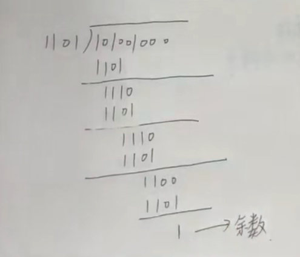

1. 给出生成多项式，例如$P(x)=x^{3}+x^{2}+1$，还有一个叫信息位或者数据，例如101001，通过这两个条件算出循环冗余码（CRC）
   1. 根据生成多项式确定除数
      1. 按示例的话，那除数就是1101，逻辑是根据$x^{i}$的系数，如果不为0，那么除数的第i位为1（从右往左算）（i从0开始）
   2. 根据生成多项式的最高阶在信息位后补0
      1. 按示例的话，最高阶为3，所以在信息位后补3个0，变成101001000
   3. 让信息位（补0）与除数做亦或运算得到余数（亦或运算：相同为0，不同为1）
      1. 
   4. 将余数补全位数，也就是往前加0，至于是多少位，那就看信息位补了多少个0，
   5. **最后，将补全位数的余数加到信息位的后面得到CRC检验码**
