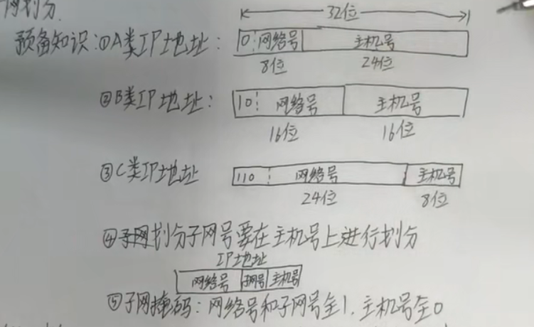

# 预备知识

> 解释一下
>
> 1. 各类IP地址的区分
>    1. 网络化前面有不同的固定值，如图，A类ip地址网络号第一位固定为0，而B类是10
>    2. 网络号和主机号的位数不同，如图，A类ip地址网络号有8位，而B类是16位
> 2. 子网
>    1. 顾名思义是网络号的细化，只能在主机号上划分
>    2. 这样ip地址的组成就变成了【网络号+子网号+主机号】，但是这样就很难区分了，所以还有个子网掩码来让人知道哪部分是主机号
>       1. 网络号和子网号为1，主机号为0

# 题型

例题：[子网划分习题及考点分析（含答案及理解）_汉堡怪兽YC的博客-CSDN博客_子网划分例题](https://blog.csdn.net/weixin_47890121/article/details/111941825)
