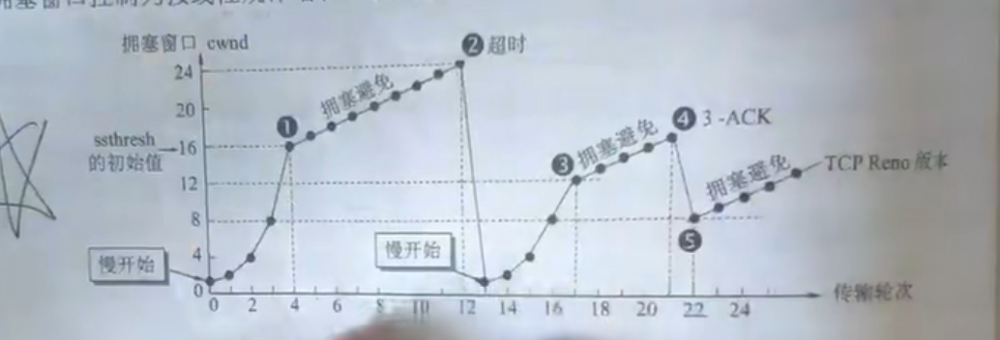

- 当TCP连接建立后，把拥塞窗口cwnd置为1
- 然后慢开始，每经过一个往返时间RTT，就翻倍，直到增长到门限值ssthresh，这里初始值设为16，之后就是超时点除以2
- 然后就执行拥塞避免算法，直到超时
- 然后又把设cwnd=1，执行慢开始算法，直到增长到这次的门限值，上次超时点位24，所以这次的门限值为$\frac{24}{2}=12$
- 然后继续开始执行拥塞避免算法，在cwnd=16时，一连收到3个对同一个报文段的重复确认，然后就直接开始执行拥塞避免算法（不执行慢开始，而是快速重传（快恢复算法）），这次从$\frac{16}{2}=8$开始（上次超时为16）
