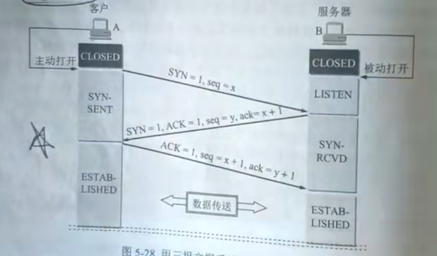
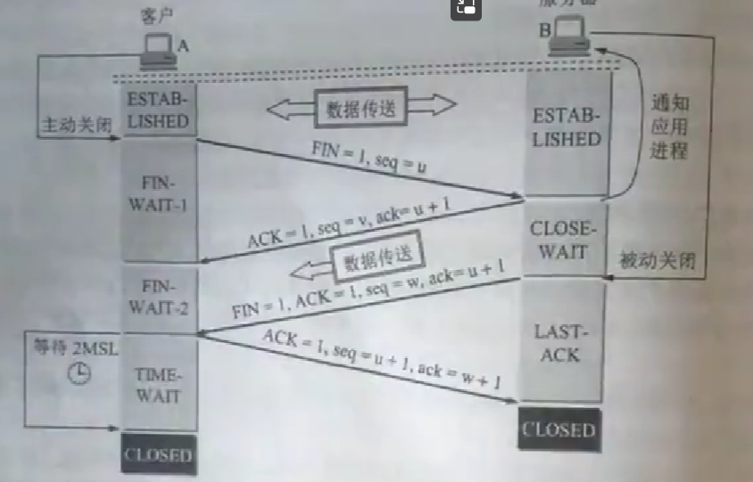

# TCP连接建立（握手）

1. 首先发送端发送同步位SYN=1，初始序号seq=x
2. 接收端收到后也发送一个同步位SYN=1，序号seq=y，并且还有确认位ACK=1，确认序号ack=x+1（对方发送过来的序号+1）
3. 然后发送端发送一个ACK=1，seq=x+1，ack=y+1

# TCP连接释放（挥手）

1. A首先发送一个结束位FIN=1，序号seq=u（u=A前面已经传送过的数据的最后一个字节的序号加1）
2. B接收到后发送确认位ACK=1，序号seq=v（v=B前面已经传送过的数据的最后一个字节的序号加1），确认号ack=u+1
3. 由于A可能还有数据在路上没发过来，B收完后再发送结束位FIN=1，ack=u+1，seq=w（上次巴拉巴拉加1）
4. A收到后确认，ACK=1，seq=u+1，ack=w+1
